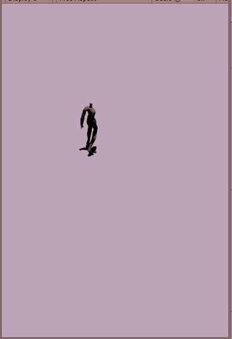

# Approach

## Session 01

**Sun Aug 11 15:21:33 - **

**To do**
- Spec in readme
- Initial commit
- Setup file sharing pipeline

**Done**
- Made dropbox folder and shared with Dan
- Simple readme setup
- Installed latest unity version
- Imported sample project to see how they do tile movement
- Initialised project with newest Unity version
- Testing sprite walk cycle
- Adding different direction walks

## Session 02

**Sun Aug 11 18:26:24 - **

**To do**
- Gitignore
- Tile based movement
    - Get input
    - Trigger animations with buttons, default to idle 

**Done**
- Root motion applied with walk animations



- tile sizes set up for true isometric angles

## Session 03

**Wed Aug 14 10:54:15 - Wed Aug 14 12:28:10**

**To do**
- Figure out a/best way to do grid-based movement 

**Done**
- Research 2d raycast
- Reasearch tilemaps
- Pseudocode the algorithm for moving the player
- Found the player position on the grid from world space

## Session 04

**Wed Aug 14 13:48:07 - Wed Aug 14 16:42:37**

**To do**
- Recenter player sprites
- Player move

**Done**
- Got the target tile location in grid space then world space
- Trying to lerp between position and target position
- Got a strange error:
```
Copying assembly from 'Temp/Assembly-CSharp.dll' to 'Library/ScriptAssemblies/Assembly-CSharp.dll' failed
```
- Restarted Unity
- Moving player with key presses, not finding right tile
- Finding correct tiles with key presses